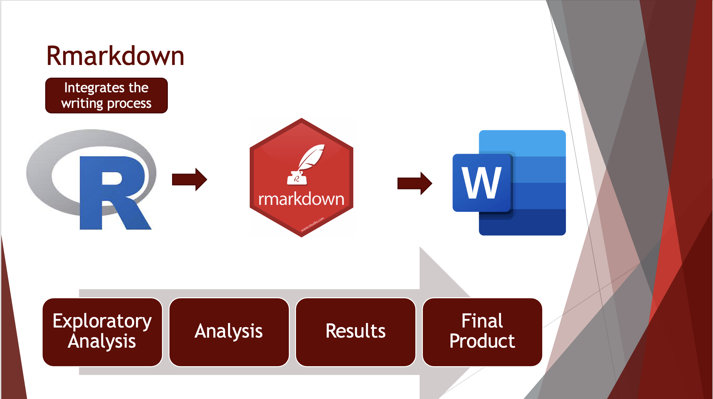

People are expressive and insightfull creatures, continually working to find deeper meaning and answers to extisential questions through profound and creative means.
The quintisential programmer may sometimes be percieved as a nerdy character who relishes structure.
However, I believe that in the era post Steve Jobs this rather rigid stereotype of computer programers, and technology gurus in general, is rather simplistic and fails to fully appreciate the true breadth and beauty that self described technology nerds have brought to the modern era. 
Consider the iPhone.
Not only is it a wonderfully functional piece of technology, but it possesses a simplistic beauty of design which captures the users eye and is approachable by even the tech illiterate. 
It is an undeniable fact that it takes a great deal of artistical skill to so accurately identify core attributes of the human conscience, and so skillfully deliver a product which reliably enables humans to use it with little training. 
I believe in the same way that is how we as scientists should endeavor to focus on our work.
True, we need to be forthright and concise in the explanation of our methodology.
But we should remember we are working to communicate complex and difficult concepts to our fellow humans. 

# Merging coding with writing
Taking this perspective to both coding and analysis, scientific communication becomes a more approachable concept, as we can see it as an extension of the system, the question, we are seeking to ask and not a separate endeavor.
This is one of the reasons that many of the manuscripts I have prepared recently were first written into a simple markdown, or rmarkdown, file using a simple text editor or programming interface. 
A programming interface, such as Rstudio or Visual Studio Code, enables the writer to think in a continous process, considering the nature of their data, the appropriateness of the analysis, explore the most interesting way to present graphics, and explain the results while free from intrucive concerns such as font type and size, layout and formatting, or even spelling. 
True, these things are important, but they can hinder thinking.
And be clear, to write is to think, hopefully at a very deep level.

Further, merging coding with with your writing provides a tangible link between the printed results and the final product. 
Anyone who has analyzed much data recognizes that often the first couple, or event tens of tries, aren't necessarily the results that are used in the final product.
As any scientists working in the big wide outside world will tell you, data is not always "pretty".
And thats ok, if data analysis was rote and straight forward, anyone, especially artificial inteligence, could do it.
But its not, analysis and scientific communication requires the scientists to study their data, analyze it in a robust and critical way, then communicate those results skillfully to the world, so that presumably the rest of the world does not have to undergo the effort you've expended to learn the same phenomenon. 
And this can cause trouble.
Ever open the folder containing all your code in a project with dread?
Combining the analytical, graphing, and writing portions of your project will ensure that when you pick the project back up, you'll be able to recreate your results, without having to run hundreds of lines of code trying to figure out where a particular number, or figure came from.
Not only does this make your results reproducable, an important aspect of conducting sound science, but it will also make your writing life much easier.

Happy Coding!