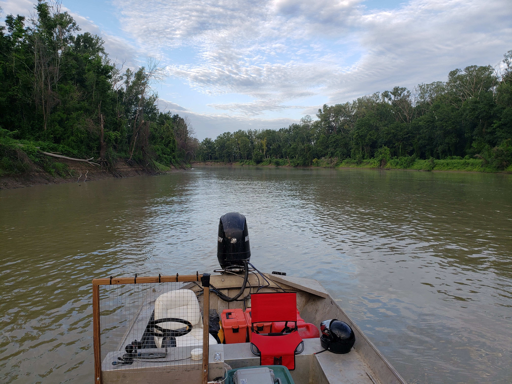

Lending a helping hand to fellow grad students is perhaps the most rewarding and enjoyable educational activities which graduate students can partake in. Benefits are two-fold. First, you gain the satisfactory feeling that comes from helping out a fellow student and friend while also learning something more about a part of science and nature which heretofore you knew absolutely nothing about. And all at zero cost, no stress, good comradeship and potentially free food. This past weekend, I had the opportunity helping a fellow student track Silver Carp (*Hypophthalmichthys molitrix*) within the lower reaches of the Yazzoo river system. As a Kansan unfamiliar with the ways of boats, big murky water, and muddy rivers, it was certainly an experience. And even though these invasive fish are known to exist throughout the Mississippi River drainage system, an area which includes the lower reaches of the Kansas river, I had personally never experienced the fish before, a fact which only served to intensify my intrigue. 

The river experience began like something straight out of a National Geographic nature documentary. Numerous times I wished I had a way of safely bringing along my camera and lens to photograph the white egrets (*Ardea alba*) who were frequently observed stalking the banks, or the quick moving birds of various types who often stood in stark contrast along the banks where the glass smooth water met the vibrant green contrast of the grassy banks. Our primary purpose that day was to download data and active track fish previously tagged with acoustic transponders to identify their geo-location, which could then be used to map their use of the sprauling water system. The active tracker utilizes an underwater microphone system designed to detect the low frequency noises emitted by the active acoustic transponders inserted into the body cavity of tagged fish, and necessitates traveling no more than 5 - 7 miles an hour. This provided the perfect opportunity to observe nature and fish in all of their glory.

![Silver carp jump as an unusual evasive manuver to avoid predaters, often with no seeming direction or plan once the jump is initiated.They often body slam back into the water, splashing murky water over everyone unfortuneate enough to be nearby. A vibration or wake, common when fishing boats are idling or coming of plane, causes them to jump in their random and frustrationg fashion. This propensity to jump, sometimes 10 feet or more in the air, makes a hazard for people in passing boats, where a several kilogram fish can pack quite a wallop. One smacking you in the face can feel like getting punched in the nose.](Silvercarp/20220807_094818.jpg)

Unfortunately, our trolling speed seemed to produce exactly the freak out frequency for all Silver Carp, who rewarded us for our efforts by giving us an hours long demonstration along the miles and miles of muddy water we transversed over the course of our two day adventure. An astute observer quickly realizes that unlike other life forms which God chose to grace our planet, fish, and Silver Carp in particular, are definitively not among the more intelligent. Rather than jumping in a logical direction away from the source of perceived danger, they randomly launch themselves, wiggling and thrashing in no particular direction and seemingly not plan to deal with gravity, as they haphazardly splash back to the water. No matter their age, they took on the appearance of uncoordinated adolescents or gangly puppies, repeatedly surprised by gravity when it halted their upward leap. A great deal of them slammed themselves into the hard aluminium bottom of our boat, causing a tremendous ruckus and mad scramble to get them out before their flopping made them bleed all over our equipment. To reward our efforts, the stranded fish twisted and contorted themselves in a massive mess of blood and feces. By the end of the day, I am pretty sure that all of us were dog tired. I'm not sure if the fish were or not, but I know I was, and I am certain my fellow grad student was as well. 

Overall, despite the mud, slime, fish smell, hot sun, and tiring trip, I think that the trip was a success on multiple fronts. First, I learned something about myself. I don't like fish. But more importantly, I learned something about the river ecosystem by observing it with a fellow student for whom studying it was their current passtion. Further, I gained a deeper appreciation for the beauty of our rivers and the danger posed by invasive species. I learned something more about a field I personally specialize in, movement ecology, the interaction between organisms and their environment, and the technology available to allow scientists an inquisitive peak into that dimension. And perhaps most important, I got to help out a graduate student in their quest to finish their degree, while furthering the scientific pursuit of knowledge. And perhaps most importantly, I learned that as much as I hate going fishing and not catching anything, having the fish jump directly into my boat is definitely not all it was dreamed to be. 